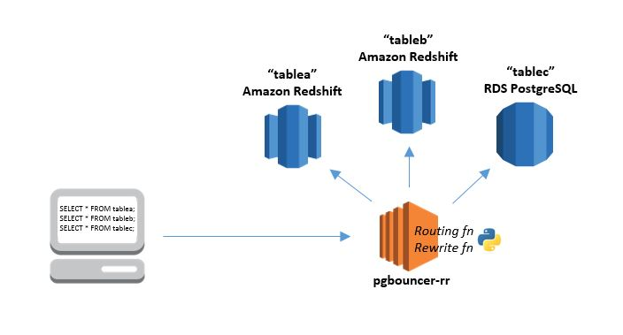
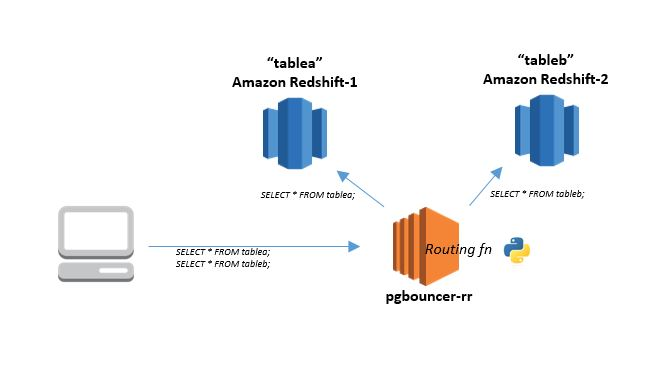

Have you ever wanted to split your database load across multiple servers or clusters without impacting the configuration or code of your client applications? Or perhaps you have wished for a way to intercept and modify application queries, so that you can make them use optimized tables (sorted, pre-joined, pre-aggregated, etc.), add security filters, or hide changes you have made in the schema?  

The [pgbouncer-fast-switchover](https://github.com/awslabs/pgbouncer-fast-switchover) project is based on [pgbouncer](https://pgbouncer.github.io/usage.html#description), an open source PostgreSQL connection pooler. It adds three new significant features:    
1. **Routing:** intelligently send queries to different database servers from one client connection; use it to partition or load balance across multiple servers/clusters.  
2. **Rewrite:** intercept and programmatically change client queries before they are sent to the server: use it to optimize or otherwise alter queries without modifying your application.
3. **Fast Switchovers:** use topology from a cluster to pre-create connections to writer/readers and automatically determine the new writer when a switchover is performed. All subsequent queries go to the new writer node.



Pgbouncer-fast-switchover works the same way as pgbouncer; any target application can be connected to pgbouncer-fast-switchover as if it were an Amazon Redshift or PostgreSQL server, and pgbouncer-fast-switchover creates a connection to the actual server, or reuses an existing connection.  

You can elect to deploy multiple instances of pgbouncer-fast-switchover to avoid throughput bottlenecks or single points of failure, or to support multiple configurations. It can live in an Auto Scaling group, and behind an Elastic Load Balancing load balancer. It can be deployed to a public subnet while your servers reside in private subnets. You can choose to run it as a bastion server using SSH tunneling, or you can use pgbouncer's recently introduced SSL support for encryption and authentication.  

Documentation and community support for pgbouncer can be easily found [online](https://pgbouncer.github.io/usage.html#description);  pgbouncer-fast-switchover is a superset of pgbouncer.  

Now I’d like to talk about the query routing and query rewrite feature enhancements.

## Query Routing

The routing feature maps client connections to server connections using a Python routing function which you provide. Your function is called for each query, with the client username and the query string as parameters. Its return value must identify the target database server; how it does this is entirely up to you.  

For example, you might want to run two Amazon Redshift clusters, each optimized to host a distinct data warehouse subject area. You can determine the appropriate cluster for any given query based on the names of the schemas or tables used in the query. This can be extended to support multiple Amazon Redshift clusters or PostgreSQL instances.  

In fact, you can even mix and match Amazon Redshift and PostgreSQL, taking care to ensure that your Python functions correctly handle any server-specific grammar in your queries; your database will throw errors if your routing function sends queries it can’t process. And, of course, any query must run entirely on the server to which it is routed; cross-database joins or multi-server transactions do not work!  

Here’s another example: you might want to implement controlled load balancing (or A/B testing) across replicated clusters or servers. Your routing function can choose a server for each query based on any combination of the client username, the query string, random variables, or external input. The logic can be as simple or as sophisticated as you want.  

Your routing function has access to the full power of the python language and the myriad of available Python modules. You can use the regular expression module ([re](https://docs.python.org/2/library/re.html)) to match words and patterns in the query string, or use the SQL parser module ([sqlparse](https://pypi.python.org/pypi/sqlparse)) to support more sophisticated/robust query parsing. You may also want to use the AWS SDK module ([boto](https://aws.amazon.com/sdk-for-python/)) to read your routing table configurations from Amazon DynamoDB.
   
The Python routing function is dynamically loaded by pgbouncer-fast-switchover, from the file you specify in the configuration:  
`routing_rules_py_module_file = /etc/pgbouncer-fast-switchover/routing_rules.py`

The file should contain the following Python function:    
`def routing_rules(username, query, in_transaction):`  
- The function parameters will provide the username associated with the client, a query string, and the value indicating whether there is an ongoing transaction.
- The function return value must be a valid database key name (dbkey) as specified in the configuration file, or `None`:
  - When a valid dbkey is returned by the routing function, the client connection will be routed to a connection in the specified server connection pool. 
  - When `None` is returned by the routing function, the client remains routed to its current server connection.   

The route function is called only for query and prepare packets, with the following restrictions: 

- All queries must run wholly on the assigned server; cross-server joins do not work  
- Ideally queries should autocommit each statement. Set `pool_mode = statement` in the configuration.
- Multi-statement transactions will work correctly only if statements are not rerouted by the routing_rules function to a different server pool mid-transaction. Set `pool_mode = transaction` in the configuration.
- If your application uses database catalog tables to discover the schema, then the routing_rules function should direct catalog table queries to a database server that has all the relevant schema objects created.   


#### Simple Query Routing Example
 
Amazon Redshift cluster 1 has data in table 'tablea'. Amazon Redshift cluster 2 has data in table 'tableb'. You want a client to be able to issue queries against either tablea or tableb without needing to know which table resides on which cluster.  

Create a (default) entry with a key, say, 'dev' in the [databases] section of the pgbouncer configuration. This entry determines the default cluster used for client connections to database 'dev'. You can make either redshift1 or redshift2 the default, or even specify a third 'default' cluster. Create additional entries in the pgbouncer [databases] section for each cluster; give these unique key names such as 'dev.1', and 'dev.2'.  

```
[databases]
dev = host=<redshift1> port=5439 dbname=dev
dev.1 = host=<redshift1> port=5439 dbname=dev
dev.2 = host=<redshift2> port=5439 dbname=dev
```
Ensure the configuration file setting `routing_rules_py_module_file` specifies the path to your python routing function file, such as `~/routing_rules.py`.
 
The code in the file could look like the following:
```
def routing_rules(username, query, in_transaction):
	if "tablea" in query:
		return "dev.1"
	elif "tableb" in query:
		return "dev.2"
	else:
		return None
```


This is a toy example, but it illustrates the concept.  
If a client sends the query SELECT * FROM tablea, it matches the first rule, and is assigned to server pool 'dev.1' (redshift1).  
If a client (and it could be the same client in the same session) sends the query SELECT * FROM tableb, it matches the second rule, and is assigned to server pool 'dev.2' (redshift2). Any query that does not match either rule results in None being returned, and the server connection remains unchanged.  

Here is an alternative function for the same use case, but the routing logic is defined in a separate extensible data structure using regular expressions to find the table matches. The routing table structure could easily be externalized in a DynamoDB table.  
```
# ROUTING TABLE
# ensure all dbkey values are defined in [database] section of the pgbouncer ini file 
routingtable = {
	'route' : [{
			'usernameRegex' : '.*',
			'queryRegex' : '.*tablea.*',
			'dbkey' : 'dev.1'
		}, {
			'usernameRegex' : '.*',
			'queryRegex' : '.*tableb.*',
			'dbkey' : 'dev.2'
		}
	],
	'default' : None
}

# ROUTING FN - CALLED FROM PGBOUNCER-RR - DO NOT CHANGE NAME
# IMPLEMENTS REGEX RULES DEFINED IN ROUTINGTABLE OBJECT
# RETURNS FIRST MATCH FOUND
import re
def routing_rules(username, query, in_transaction):
	for route in routingtable['route']:
		u = re.compile(route['usernameRegex'])
		q = re.compile(route['queryRegex'])
		if u.search(username) and q.search(query):
			return route['dbkey']
	return routingtable['default']
```

You will most likely want to implement more robust and sophisticated rules, taking care to avoid unintended matches. Write test cases to call your function with different inputs and validate the output dbkey values.  


## Query Rewrite

The rewrite feature provides the opportunity to manipulate application queries en route to the server, without modifying application code. You might want to do this to:
 - Optimize an incoming query to use the best physical tables, when you have: 
   - Replicated tables with alternative sort/dist keys and column subsets (*emulate projections*).
   - Stored pre-joined or pre-aggregated data (*emulate 'materialized views'*)
 - Apply query filters to support row level data partitioning/security
 - Roll out new schemas, resolve naming conflicts and the like, by changing identifier names on the fly.
 
The rewrite function is also implemented in a fully configurable python function, dynamically loaded from an external module specified in the configuration:
`rewrite_query_py_module_file = /etc/pgbouncer-fast-switchover/rewrite_query.py`

The file should contain the python function:    
`def rewrite_query(username, query, in_transaction):`  
- The function parameters will provide the username associated with the client, a query string, and the value indicating whether there is an ongoing transaction.
- The function return value must be a valid SQL query string which will return the result set you want the client application to receive. 
  
Implementing a query rewrite function is straightforward when the incoming application queries have fixed formats that are easily detectable and easily manipulated, perhaps using regular expression search/replace logic in the Python function. It is much more challenging to build a robust rewrite function to handle SQL statements with arbitrary format and complexity.  

Enabling the query rewrite function triggers pgbouncer-fast-switchover to enforce that a complete query is contained in the incoming client socket buffer. Long queries are often split across multiple network packets; they should all be in the buffer before the rewrite function is called. This requires that the buffer size be large enough to accommodate the largest query. The default buffer size (2048) is likely too small, so specify a much larger size in the configuration: `pkt_buf = 32768`  

If a partially received query is detected, and there is room in the buffer for the remainder of the query, pgbouncer-fast-switchover waits for the remaining packets to be received before processing the query. If the buffer is not large enough for the incoming query, or if it is not large enough to hold the re-written query (which may be longer than the original), then the rewrite function will fail. By default, the failure is logged, and the original query string will be passed to the server unchanged. You can force the client connection to terminate instead, by setting:  `rewrite_query_disconnect_on_failure = true`.  

 
#### Simple Query Rewrite Example

Scenario:  
You have a star schema with a large fact table in Redshift (say, 'sales') with two related dimension tables (say 'store' and 'product'). You want to optimize equally for two different queries:
```
1> SELECT storename, SUM(total) FROM sales JOIN store USING (storeid) GROUP BY storename ORDER BY storename
2> SELECT prodname, SUM(total) FROM sales JOIN product USING (productid) GROUP BY prodname ORDER BY prodname
```
By experimenting, you have determined that the best possible solution is to have two additional tables, each optimized for one of the queries:  
1. store_sales: store and sales tables denormalized, pre-aggregated by store, and sorted and distributed by store name.  
2. product_sales: product and sales tables denormalized, pre-aggregated by product, sorted and distributed by product name.  

So you implement the new tables, and take care of their population in your ETL processes. 
But, you'd like to avoid directly exposing these new tables to your reporting or analytic client applications. This might be the best optimization today, but who knows what the future holds? Maybe you'll come up with a better optimization later, or maybe Redshift will introduce cool new features that provide a simpler alternative.

So, you implement a pgbouncer-fast-switchover rewrite function to change the original queries on the fly.

Ensure the configuration file setting `rewrite_query_py_module_file` specifies the path to your python function file, say `~/rewrite_query.py`.

The code in the file could look like this:
```
import re
def rewrite_query(username, query, in_transaction):
    q1="SELECT storename, SUM\(total\) FROM sales JOIN store USING \(storeid\) GROUP BY storename ORDER BY storename"
    q2="SELECT prodname, SUM\(total\) FROM sales JOIN product USING \(productid\) GROUP BY prodname ORDER BY prodname"
    if re.match(q1, query):
        new_query = "SELECT storename, SUM(total) FROM store_sales GROUP BY storename ORDER BY storename;"
    elif re.match(q2, query):
        new_query = "SELECT prodname, SUM(total) FROM product_sales GROUP BY prodname ORDER BY prodname;"
    else:
        new_query = query
    return new_query
```


Again, this is a toy example to illustrate the concept. In any real application, your python function will need to employ more robust query pattern matching and substitution.  

Your reports and client applications use the same join query as before:  
```
SELECT prodname, SUM(total) FROM sales JOIN product USING (productid) GROUP BY prodname ORDER BY prodname;
```
But now, when you look in the Redshift console 'Queries' tab, you will see that the  query received by Redshift is the rewritten version that uses the new product_sales table - leveraging your pre-joined, pre-aggregated data and the targeted sort and dist keys:
```
SELECT prodname, SUM(total) FROM product_sales GROUP BY prodname ORDER BY prodname;
```
## Fast Switchovers

Pgbouncer-fast-switchover makes use of a metadata table in a Postgres multi-node cluster to determine all nodes. If using fast switchovers, PgBouncer will create a connection pool to the configured writer on start-up and `RELOAD`. The `topology_query` is used to determine the additional nodes in the cluster, and new connection pools are also created to the nodes. Once a switchover or failover is detected, PgBouncer will pause new client connections until a new writer is detected from the remaining healthy nodes using `pg_is_in_recovery()` to poll every 100ms. After the writer is determined, connections are resumed and all new queries are routed to the promoted writer.

#### Configuration

Below you will find an example configuration that works with an [RDS Multi-AZ with readable standby](https://aws.amazon.com/rds/features/multi-az/) cluster. Options that can be configured include:

`polling_frequency`: How often to poll for a new writer in seconds. Maps to 100ms by default (.1).
`server_failed_delay`: How long to wait before attempting to recreate a connection pool to the old writer during a switchover. 30 seconds is the default.

The following uses default polling times and a `topology_query` configured to work with RDS PostgreSQL.

```ini
[databases]
postgres = host=writer.cluster-cpkicoma6jyq.us-west-2.rds.amazonaws.com port=5432 user=master password=notaverysecurepassword dbname=postgres topology_query='select endpoint from rds_tools.show_topology(\'pgbouncer\')'

[pgbouncer]
listen_addr = *
listen_port = 5432
auth_type = plain
auth_file = userlist.txt
server_tls_sslmode = require
pool_mode = session
max_client_conn = 100
logfile = pgbouncer.log
pidfile = pgbouncer.pid
admin_users = admindb
```

# Getting Started

**Install**  
Download and install pgbouncer-fast-switchover by running the following commands (Amazon Linux/RHEL/CentOS):
```
# install required packages - see https://github.com/pgbouncer/pgbouncer#building
sudo yum install libevent-devel openssl-devel python-devel libtool git patch make -y

# download the latest tested pgbouncer distribution - 1.19
git clone https://github.com/pgbouncer/pgbouncer.git --branch "stable-1.19"

# download pgbouncer-fast-switchover extensions
git clone https://github.com/awslabs/pgbouncer-fast-switchover.git

# merge pgbouncer-fast-switchover extensions into pgbouncer code
cd pgbouncer-fast-switchover
./install-pgbouncer-rr-patch.sh ../pgbouncer

# build and install
cd ../pgbouncer
git submodule init
git submodule update
./autogen.sh
./configure
make
sudo make install
``` 

**Configure**  
Create a configuration file, using `./pgbouncer-example.ini` as a starting point, adding your own database connections and python routing rules / rewrite query functions.  

Set up user authentication - see [authentication file format](https://pgbouncer.github.io/config.html#authentication-file-format). NOTE: the recently added pgbouncer `auth_query` feature will unfortunately not work with Amazon Redshift.  

By default, pgbouncer-fast-switchover does not support SSL/TLS connections. However, you can experiment with pgbouncer's newest [TLS/SSL feature](https://github.com/pgbouncer/pgbouncer/blob/master/doc/config.rst#tls-settings). Just add a private key and certificate to your pgbouncer-fast-switchover configuration:
```
client_tls_sslmode=allow
client_tls_key_file = ./pgbouncer-fast-switchover-key.key
client_tls_cert_file = ./pgbouncer-fast-switchover-key.crt
```
Hint: Here's how to easily generate a test key with a self-signed certificate using openssl:
```
openssl req -newkey rsa:2048 -nodes -keyout pgbouncer-fast-switchover-key.key -x509 -days 365 -out pgbouncer-fast-switchover-key.crt
```
  
**Configure firewall**  
Configure your linux firewall to enable incoming connections on the configured pgbouncer-fast-switchover listening port. Example:
```
sudo firewall-cmd --zone=public --add-port=5439/tcp --permanent
sudo firewall-cmd --reload
```
If you are running pgbouncer-fast-switchover on an Amazon EC2 instance, the instance Security Group must also be configured to allow incoming TCP connections on the listening port.  
  
**Launch**  
Run pgbouncer-fast-switchover as a daemon using the commandline `pgbouncer <config_file> -d`.   
See `pgbouncer --help` for commandline options. _Hint: use `-v` to enable verbose logging. If you look carefully in the logfile you will see evidence of the query routing and query rewrite features in action._  

**Connect**  
Configure your client application as though you were connecting directly to a Redshift or PostgreSQL database, but be sure to use the pgbouncer-fast-switchover hostname and listening port.  
Example – using psql   
```
psql -h pgbouncer-dnshostname -U dbuser -d dev -p 5439
```
Example – JDBC driver URL (Redshift driver)
```
jdbc:redshift://pgbouncer-dnshostname:5439/dev
```
## Run a Local Container

There is a [Dockerfile](./Dockerfile.local) to build and run a fast switchover aware PgBouncer. While it can work with any cluster that has a topology metadata table,
the example configuration is provided to work with [RDS Postgres Multi-AZ with two readable standbys](https://aws.amazon.com/rds/features/multi-az/#Amazon_RDS_Multi-AZ_with_two_readable_standbys).

If not using RDS, ensure that the `topology_query` in the configuration returns the
topology for your cluster. Here is an example:

```SQL
postgres=> select * from rds_tools.show_topology('pgbouncer');
              id               |                                          endpoint                         | port
-------------------------------+---------------------------------------------------------------------------+------
 db-ZNHD4Q25OCUDELFUMGH3D6KUTY | persistent-cluster-v2-instance-3.cpkicoma6jyq.us-west-2.rds.amazonaws.com | 5432
 db-5NZJJM5NH2RXAVCP66XGPCOU5Y | persistent-cluster-v2-instance-2.cpkicoma6jyq.us-west-2.rds.amazonaws.com | 5432
 db-5XTOYZVCWZK7SMRSBBOOG6JINQ | persistent-cluster-v2-instance-1.cpkicoma6jyq.us-west-2.rds.amazonaws.com | 5432
(3 rows)
```

On RDS, ensure the `rds_tools` extension is created before starting the container. The topology is used
by PgBouncer to pre-create connection pools to all nodes.

```SQL
postgres=> CREATE EXTENSION rds_tools;
CREATE EXTENSION
```

Update the example PgBouncer [configuration](./pgbouncer.ini) to
point to your multi-node cluster. 
- Ensure you update your username and password.
- Search for "change" in the configuration.

Also make credential updates to the [userlist](./userlist.txt). Both of these
configurations will be bind mounted into the container.

### Directions for RDS Postgres Multi-AZ with two readable standbys on EC2

First, ensure your Postgres cluster with two readable standbys is created and
the status returns `available`. This ensures the cluster is fully created and will
accept writes.

```sh
$ aws rds describe-db-clusters |jq '.DBClusters[] | select(.DBClusterIdentifier == "cluster-name") | .Status'
"available"
```

Once your cluster is ready, connect to the writer endpoint and create the `rds_tools` extension.

```sh
# ensure psql is installed. This was run on an AL2023 EC2 instance.
$ sudo yum install postgresql15-15.0-1.amzn2023.0.2.x86_64

$ psql -h <your-writer-endpoint> -U master postgres
Password for user master:
psql (15.0, server 15.4)
SSL connection (protocol: TLSv1.2, cipher: ECDHE-RSA-AES256-GCM-SHA384, compression: off)
Type "help" for help.

postgres=> CREATE EXTENSION IF NOT EXISTS rds_tools;
CREATE EXTENSION
```

Set up and install Docker. These directions allow you to run the container
as the EC2 user.

```sh
$ sudo yum install docker
$ sudo usermod -a -G docker ec2-user
# log in to the new group immediately
$ newgrp docker

# start docker
$ sudo systemctl enable --now docker.service
```

Clone the repository locally

```sh
$ git clone https://github.com/awslabs/pgbouncer-fast-switchover.git
$ cd pgbouncer-fast-switchover
```

Build the container

```sh
$ docker build -f Dockerfile.local . -t pgbouncer
```

Update pgbouncer.ini to point to your cluster. Modify the following to match your cluster information

- `<change-to-cluster-endpoint>`: this should be the writer endpoint of your cluster. You can get this using the AWS CLI
and jq: ```aws rds describe-db-clusters |jq '.DBClusters[] | select(.DBClusterIdentifier == "cluster-name") | .Endpoint'```
- `<change-dbuser>`: the user name you use to connect to your cluster
- `<change-dbpassword>`: the password you use to connect to your cluster

Start the container

```sh
$ docker run -v $(pwd)/pgbouncer.ini:/home/pgbouncer/pgbouncer.ini -v $(pwd)/userlist.txt:/home/pgbouncer/userlist.txt --network host --rm -it pgbouncer /start.sh 
<snip>
2023-09-22 20:52:52.649 UTC [9] LOG kernel file descriptor limit: 1024 (hard: 1024); max_client_conn: 100, max expected fd use: 132
2023-09-22 20:52:52.649 UTC [9] LOG listening on 0.0.0.0:5432
2023-09-22 20:52:52.649 UTC [9] LOG listening on [::]:5432
2023-09-22 20:52:52.649 UTC [9] LOG listening on unix:/tmp/.s.PGSQL.5432
2023-09-22 20:52:52.650 UTC [9] LOG process up: PgBouncer 1.19.1, libevent 2.1.12-stable (epoll), adns: evdns2, tls: OpenSSL 3.0.8 7 Feb 2023
<snip>
2023-09-29 17:57:01.966 UTC [9] LOG S-0x1508cc0: test-instance-1/master@172.31.14.107:5432 new connection to server (from 172.31.42.81:35612)
2023-09-29 17:57:01.972 UTC [9] LOG S-0x1508800: test-instance-3/master@172.31.17.50:5432 new connection to server (from 172.31.42.81:36184)
2023-09-29 17:57:02.004 UTC [9] LOG S-0x1508cc0: test-instance-1/master@172.31.14.107:5432 SSL established: TLSv1.2/ECDHE-RSA-AES256-GCM-SHA384/ECDH=prime256v1
2023-09-29 17:57:02.005 UTC [9] LOG S-0x1508800: test-instance-3/master@172.31.17.50:5432 SSL established: TLSv1.2/ECDHE-RSA-AES256-GCM-SHA384/ECDH=prime256v1
2023-09-29 17:57:02.005 UTC [9] LOG S-0x1508a60: test-instance-2/master@172.31.47.109:5432 new connection to server (from 172.31.42.81:60782)
2023-09-29 17:57:02.033 UTC [9] LOG S-0x1508a60: test-instance-2/master@172.31.47.109:5432 SSL established: TLSv1.2/ECDHE-RSA-AES256-GCM-SHA384/ECDH=prime256v1
```

Notice in the output above that connection pools are precreated to your three nodes (`test-instance-{1,2,3}`). Your PgBouncer container is now
ready to provide fast switchovers.

Optionally, start PgBouncer in verbose mode by setting the `VERBOSE` environment variable

```sh
$ docker run -e VERBOSE="-vv" ...
```

Connect to your instance

```sh
$ psql -h localhost -p 5432 -U testuser postgres
Password for user testuser:
psql (15.0, server 15.4)
Type "help" for help.

postgres=>
```

## Deploy pgbouncer in Elastic Kubernetes Service (EKS)  

### Dockerization and deployment considerations
We choose to deploy PGBouncer as a container on [Amazon Elastic Kubernetes Service (EKS)](https://aws.amazon.com/eks/) to allow it to horizontally scale to the Redshift or Postgresql client load. We first containerized and stored the image in [Amazon Elastic Container Registry (ECR)](https://aws.amazon.com/ecr/); then we deployed Kubernetes (1) [Deployment](https://kubernetes.io/docs/concepts/workloads/controllers/deployment/) and (2) [Service](https://kubernetes.io/docs/concepts/services-networking/service/). The Kubernetes Deployment,[pgbouncer-deploy.yaml](./pgbouncer-deploy.yaml) defines the PGBouncer configuration, such as logging or the location of routing rules, as well as Redshift and Postgresql database cluster endpoint credentials. The startup script [start.sh](./start.sh) generates the `pgbouncer.ini` upon the PGBouncer container init (so don't look for it here)

```yaml
          envFrom:
            - secretRef:
               name: pgbouncer
          env:
           - name: default_pool_size
             value: "20"
           - name: log_connections
             value: "1"
           - name: log_disconnections
             value: "1"
           - name: log_pooler_errors
             value: "1"
           - name: log_stats
             value: "1"
           - name: routing_rules_py_module_file
             value: "/home/pgbouncer/routing_rules.py"
```

Security wise, we run the PGBouncer process in a non-root user to limit the process scope. 

```dockerfile
...
RUN useradd -ms /bin/bash pgbouncer && \
    chown pgbouncer /home/pgbouncer && \
    chown pgbouncer /

USER pgbouncer
WORKDIR /home/pgbouncer
...
```

We also use Kubernetes secrets to allow secure credentials loading at runtime only. The secrets are created with [create-secrets.sh](./create-secrets.sh) that issue `kubectl create secret generic` with a local secret file, pgbouncer.secrets. Make sure you avoid loading the file to your git repository by adding `*.secrets` to your `.gitignore`. Here is an example of a secret file:

```yaml
PGB_DATABASE1=dev = host= <redshift1>port=5432 dbname=dev
PGB_DATABASE2=dev.1 = host=<redshift1> port=5432 dbname=dev
PGB_DATABASE3=dev.2 = host=<redshift2> port=5432 dbname=dev
PGB_ADMIN_USERS=myrsuser
PGB_ADMIN_PASSWORDS=mym0stsecurepass0wrd
```

The Kubernetes Service,[pgbouncer-svc.yaml](./pgbouncer-svc.yaml) uses Network Load Balancer that points to the PGBouncer containers deployed in the Kubernetes cluster public subnets. We choose to allow public access to the PGBouncer endpoint for demonstration purposes but we can limit the endpoint to be internal for production systems. Note, you need to deploy the [AWS Load Balancer Controller](https://kubernetes-sigs.github.io/aws-load-balancer-controller/v2.4/) to automate the integration between EKS and NLB. The AWS Load Balancer Controller uses annotations like:

```yaml
  annotations:
    service.beta.kubernetes.io/aws-load-balancer-type: "external"
    service.beta.kubernetes.io/aws-load-balancer-name: "pgbouncer"
    service.beta.kubernetes.io/aws-load-balancer-nlb-target-type: "ip"
    service.beta.kubernetes.io/aws-load-balancer-scheme: "internet-facing"
```

`aws-load-balancer-scheme:"internet-facing"` exposes the PGBouncer service publicly. `aws-load-balancer-nlb-target-type: "ip"` uses the PGBouncer pods as target rather than the EC2 instance. 


### Deployment steps
The EKS option automates the configuration and installation sections above. The deployment steps with EKS are:

* [Deploy EKS cluster with Karpenter for automatic EC2 instance horizontal scaling](https://karpenter.sh/getting-started/getting-started-with-karpenter/)

* [Install the AWS Load Balancer Controller add-on](https://docs.aws.amazon.com/eks/latest/userguide/aws-load-balancer-controller.html)

* Build the Pgbouncer docker image continuously

1/ Populate the following enviroment variables.

```bash
export AWS_ACCOUNT_ID=$(aws sts get-caller-identity --output text --query Account)
export AWS_REGION=us-west-2
export BASE_REPO=baseimage
export BASE_TAG=multiarch-al2
export BASE_ARM_TAG=arm64
export BASE_AMD_TAG=amd64
export PGB_REPO=pgbouncer
export PGB_TAG=fastswitchover.pg.stable.1.19.multiarch
export PGB_ARM_TAG=arm64
export PGB_AMD_TAG=amd64
export GITHUB_OWNER=awslabs
export GITHUB_BRANCH=ci-build
export GITHUB_REPO=pgbouncer-fast-switchover
export PANDOC_VER=3.1.7
export PGB_GITHUB_BRANCH=stable-1.19
```

NEED Fix 4 :2/ Build pipeline for the base image

```bash
./ci-build/deploy-base-pipeline.sh 
```

3/ Build pipeline for the pgbouncer-fast-swithcover image

```bash
./ci-build/deploy-pgb-pipeline.sh
```

* NEED FIX3 - Build the PGBouncer Docker image locally.

```bash
./build.sh
```

* Deploy PGBouncer replicas 

```bash
kubectl apply -f pgbouncer-deploy.yaml
```

* Deploy PGBouncer NLB

```bash
kubectl apply -f pgbouncer-svc.yaml
```

* Discover the NLB endpoint

```bash
kubectl get svc pgbouncer
NAME        TYPE           CLUSTER-IP      EXTERNAL-IP                                              PORT(S)          AGE
pgbouncer   LoadBalancer   10.100.190.30   pgbouncer-14d32ab567b83e8f.elb.us-west-2.amazonaws.com   5432:31005/TCP   2d1h
```

Use the EXTERNAL-IP value, `pgbouncer-14d32ab567b83e8f.elb.us-west-2.amazonaws.com` as the endpoint to connect the database

### How to view the pgbouncer-fast-switchover logs?

Pgbouncer default logging writes the process logs to stdout and stderr as well as a preconfigured log file. One can view the log in three ways:
* [Get a shell to the pgbouncer running container and view the log](https://kubernetes.io/docs/tasks/debug/debug-application/get-shell-running-container/)
Discover the pgbouncer process by:

```bash
[pgbouncer-fast-switchover-patch]$kubectl get po 
NAME                           READY   STATUS    RESTARTS   AGE
appload-6cb95bb44b-s6kgb       1/1     Running   0          41h
appselect-7678cc87b6-cdfq9     1/1     Running   0          41h
fluentbit-976pf                1/1     Running   0          3d2h
fluentbit-b8st4                1/1     Running   0          191d
pgbouncer-5dc7498984-f6js2     1/1     Running   0          41h
```

Use the `pgbouncer-5dc7498984-f6js2` for getting the container shell

```bash
[pgbouncer-fast-switchover-patch]$kubectl exec -it pgbouncer-5dc7498984-f6js2 -- /bin/bash
[pgbouncer@pgbouncer-5dc7498984-f6js2 ~]$ vi pgbouncer.log
```

* Get the container stdout and stderr. 
Viewing the container's stdout and stderr is preferred if the pgbouncer process is the only one running. 

```bash
[pgbouncer-fast-switchover-patch]$kubectl logs pgbouncer-5dc7498984-f6js2
```

* View the logs in CloudWatch. 
To stream container logs running in Amazon Elastic Kubernetes Service (Amazon EKS) to a logging system like CloudWatch Logs follow https://aws.amazon.com/premiumsupport/knowledge-center/cloudwatch-stream-container-logs-eks/ 
   
### How to make configuration changes?
You must push changes to EKS if you need to modify the pgbouncer configuration or binaries. Changing configurations is done using the kubectl tool, but updating binaries requires rebuilding the docker image and pushing it to the image registry (ECR). Below we describe both methods.

* Making configuration changes
The pgbouncer-fast-switchover config is stored in [pgbouncer-deploy.yaml](./pgbouncer-deploy.yaml) or [pgbouncer-svc.yaml](./pgbouncer-svc.yaml). Say we wanted to increase the [default_pool_size](https://www.pgbouncer.org/config.html). You need to modify `default_pool_size` in [pgbouncer-deploy.yaml](./pgbouncer-deploy.yaml) and execute:

```bash
kubectl apply -f ./pgbouncer-deploy.yaml
```
* Making binaries changes
The pgbouncer-fast-switchover docker specification is stored in [Dockerfile](./Dockerfile). Say you want to upgrade the pgbouncer version from 1.15 to 1.16. You need to modify `--branch "pgbouncer_1_15_0"`. Instead of:

```dockerfile
RUN git clone https://github.com/pgbouncer/pgbouncer.git --branch "pgbouncer_1_15_0" && \
```
use

```dockerfile 
RUN git clone https://github.com/pgbouncer/pgbouncer.git --branch "pgbouncer_1_16_0" && \
```

Then you rebuild and push the changes to the docker image registry and rollout the changes in Kubernetes

```bash
./build.sh
kubectl rollout restart deploy pgbouncer
```

# Other uses for pgbouncer-fast-switchover

It can be used for lots of things, really. In addition to the examples shown above, here are some other use cases suggested by colleagues:  

- Serve small or repetitive queries from PostgreSQL tables consisting of aggregated results.  
- Parse SQL for job tracking tablenames to implement workload management with job tracking tables on PostgreSQL, simplifies application development.  
- Leverage multiple Redshift clusters to serve dashboarding workloads with heavy concurrency requirements.  
  - _determine the appropriate route based on the current workload/state of cluster resources (always route to the cluster with least running queries, etc)._
- Use Query rewrite to parse SQL for queries which do not leverage the nuances of Redshift query design or query best practices either block these queries or re-write them for performance.  
- Use SQL parse to limit end users ability to access tables with adhoc queries. e.g. identify users scanning N+ years of data and instead issue a query which blocks them with a re-write: SELECT 'WARNING: scans against v_all_sales must be limited to no more than 30 days' as alert;  
- Use SQL parse to identify queries which filter on certain criteria to re-write the query to direct the query towards a specific table containing data matching that filter.  

Actually, your use cases don't need to be limited to just routing and query rewriting! You could design a routing function that leaves the route unchanged, but which instead implements purposeful side effects, such as:  
- Publish custom CloudWatch metrics, enabling you to monitor specific query patterns and/or user interactions with your database(s).  
- Capture SQL DDL and COPY/Write Statements and wrap them into Kinesis `put-records` as input to the method described in Erik Swensson's most excellent post: [Building Multi-AZ or Multi-Region Amazon Redshift Clusters](https://blogs.aws.amazon.com/bigdata/post/Tx13ZDHZANSX9UX/Building-Multi-AZ-or-Multi-Region-Amazon-Redshift-Clusters)  

We'd love to hear your thoughts and ideas for pgbouncer-fast-switchover functions.    


# Legal Notice

Copyright 2015-2015 Amazon.com, Inc. or its affiliates. All Rights Reserved.

Licensed under the Amazon Software License (the "License"). You may not use this file except in compliance with the License. A copy of the License is located at http://aws.amazon.com/asl/ or in the "license" file accompanying this file. This file is distributed on an "AS IS" BASIS, WITHOUT WARRANTIES OR CONDITIONS OF ANY KIND, express or implied. See the License for the specific language governing permissions and limitations under the License.

